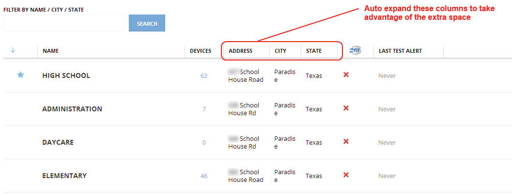

# Tables POC

## Motivation

Currently our tables have some limitations. For example, since we have fixed width on each column, we are not taking advantage of adapting column width to content.

We arrives at this place due a number of decisions that departed us for simple old HTML tables:

* Scroll bar inside table, to see the column headers all the time.
* Focus on small screens (~1024px) forgetting bigger ones.
* No enough knowledge about real data at the moment of design the screen.

We have been fixing particular cases, expanding some columns, reducing others and allow some of the to be defined based on screen width percentage, but it is not enough. It give us a lot of work, and sometimes we are missing things.

At the beginning we did not have pagination, so it was really important to make headers always visible. Now, we are showing only twenty items by page, so we think that we can sacrifice the inner table scroll and, instead, get the benefit of column widths adaptable to content.

It looks simple, but we still have some restrictions, so, we need to define how to deal with it, and how to mitigate edge cases.

## Requirements

Basically the main requirement is to define way to configure tables easily and without too much fine tunning for particular cases. For that reason we decided to take advantage of automatic table layout features provided by all the browsers.

We should take into account small screens (~1024px) in order to allow to use the system on them, but maybe with some little drawbacks if it is need.

Eye movement could be also a problem, so it should be taken into account. So, it is possible that a large table on wide monitor o not fill all the space.

## Proposed solutions

The main proposal is to **allow the table to adapt the column widths to the content** `[S01]` and **define minimum and maximum widths for each column** `[S02]` in order to get a balanced table based on the expected contents besides exceptional cases. It is possible to **define standard classes for different kind of columns** `[S03]`.

To avoid columns without width range, **default minimum and maximum widths will be defined values for all columns in general** `[S04]`.

In big tables, the summatory of all maximum widths, could be greater than the available space, in that case the columns will be reduced to fit into available place. We want to also **limit the maximum table width** `[S05]` in order to reduce the eye movement for big tables in wide screens.

If the screen available space is less than summatory of all minimum widths, inevitably there will be a scroll. So, it should be taken into account when it is defined what data will be shown in a table.

The **words wider than the cell maximum width should be cropped and an ellipsis will be shown** `[S06]`, in that way will be avoid to show text outside the column.

In order to deal gracefully with long text headers for narrow columns, **headers text should not broken into more than one line, should be cropped, an ellipsis will be shown, and the full text will be available as tooltip** `[S07]`.

## Notes

1.  We refused to set a minimum page size `[N01]`, because the elements inside the page will constrain it. For example, if it is necessary to force the width of a form, it is a form constrain, not a page one.
2.  In the same way, it is not defined a maximum page size `[N02]`, if we need to enforce a max width for an element in order to reduce eye movement, it is constrain of the element.
3.  It is possible to force the table to fill all available space (up to table maximum width), in that case maximum column widths will be ignored `[N03]`. I am not sure if it is a good idea because it could give us problems with narrow content, we can try on Portal with current tables.

## Related readings

* [Tables (W3C recommendation)](http://www.w3.org/TR/CSS21/tables.html)
* [What is the behavior when sum of widths of columns != table width?](http://stackoverflow.com/questions/8251517/what-is-the-behavior-when-sum-of-widths-of-columns-table-width)
* [A Complete Guide to the Table Element](http://css-tricks.com/complete-guide-table-element/)